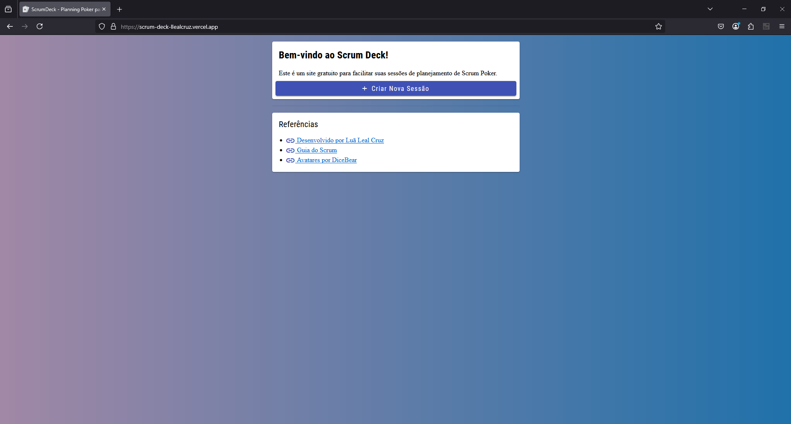
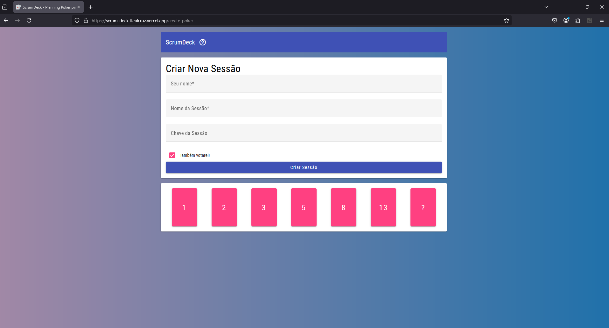
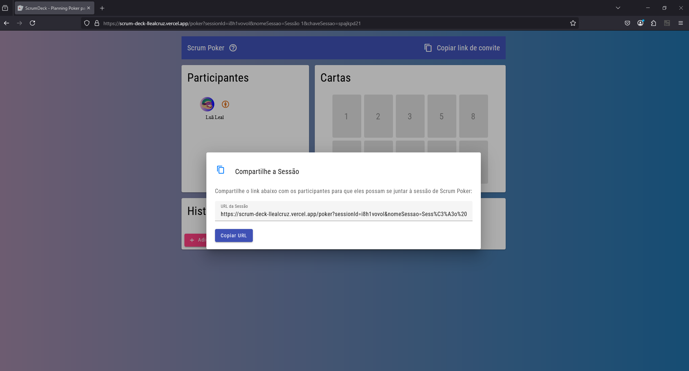
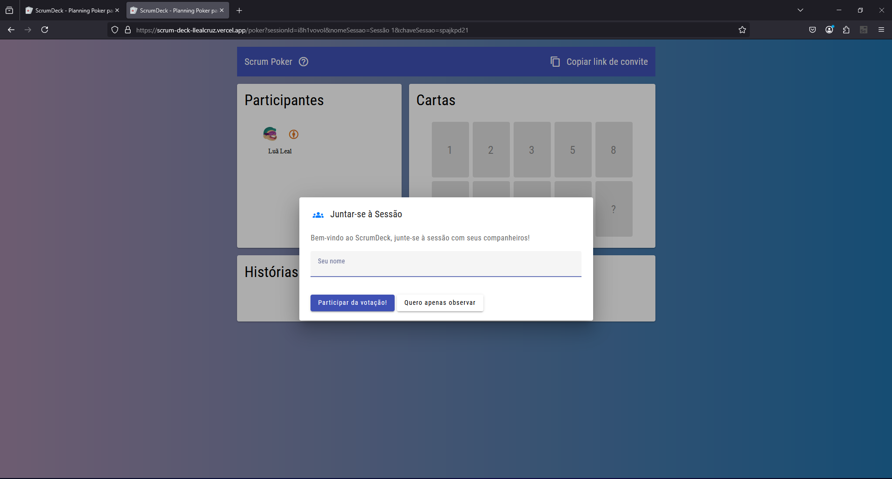
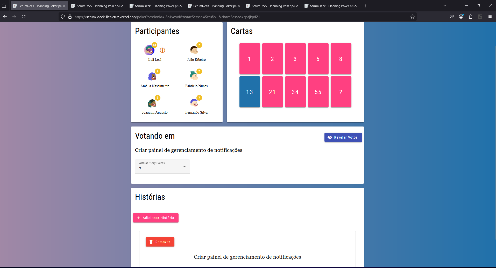

# Scrum Poker – Estimativas Ágeis em Tempo Real

Desenvolvi um Scrum Poker moderno e eficiente para auxiliar equipes ágeis na estimativa de histórias. O sistema está disponível publicamente em https://scrum-deck-llealcruz.vercel.app, com o frontend hospedado na Vercel e o backend na Fly.io, ambos de forma gratuita.

O frontend foi desenvolvido em Angular, enquanto o backend utiliza Node.js sem banco de dados. Todas as informações (salas, usuários, votos e histórias) são gerenciadas em memória, utilizando webhooks para comunicação eficiente e em tempo real.

Embora o sistema seja aberto ao público, o código-fonte não está disponível no GitHub, pois se trata de um projeto particular. Como há interação entre usuários externos, manter o código fechado aumenta a segurança da aplicação.

### Tela inicial

  

### Criando nova sessão..

  

### Compartilhando sessão..

  

### Se juntando à sessão..

  

### Poker em progresso!

  

